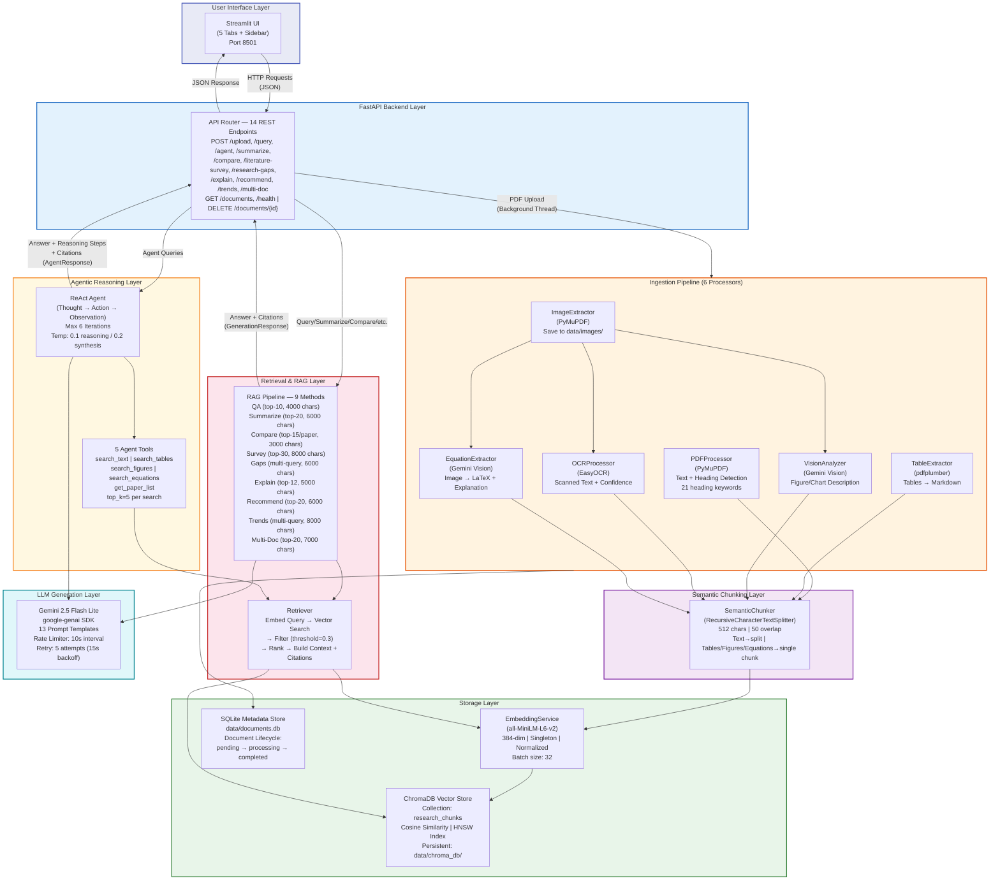

# PPT Content — Final Phase 2 Presentation

## Team 22UG091 | A Modular Multimodal Retrieval-Augmented Agentic Framework for Intelligent Scientific Document Understanding

---

## SLIDE ORDER OVERVIEW

| Slide # | Title | Status |
|---------|-------|--------|
| 1 | Title Slide | Keep as is |
| 2 | Approval From Guide | Keep as is |
| 3 | Introduction | **UPDATE** |
| 4 | Problem Definition / Objectives | **UPDATE** |
| 5 | Justification for the Proposed Problem | Minor update |
| 6-10 | Literature Survey (5 slides) | Keep as is |
| 11 | Software/Tools Requirements | **UPDATE** |
| 12 | Novelty of the Work | **UPDATE** |
| 13 | Impact of the Work | Keep as is |
| 14 | Utility of the Work | Keep as is |
| 15 | **System Implementation Overview** | **NEW SLIDE** |
| 16 | **Ingestion Pipeline** | **NEW SLIDE** |
| 17 | **RAG Pipeline & Features** | **NEW SLIDE** |
| 18 | **ReAct Agent Module** | **NEW SLIDE** |
| 19 | **API Endpoints** | **NEW SLIDE** |
| 20 | **Streamlit UI (5 Tabs)** | **NEW SLIDE** |
| 21 | **Project Structure** | **NEW SLIDE** |
| 22 | **Demo / Screenshots** | **NEW SLIDE** |
| 23 | Architecture Diagram | **UPDATE** with new Mermaid diagram |
| 24-25 | References | Keep as is |
| 26 | Thank You | Keep as is |

---

---

## SLIDE 1 — Title Slide

**Status:** Keep as is. No changes needed.

---

## SLIDE 2 — Approval From Guide

**Status:** Keep as is. No changes needed.

---

## SLIDE 3 — Introduction

**Status:** UPDATE — Replace existing bullet points with implementation-accurate content.

### Content:

**Title: Introduction**

- Scientific documents increasingly contain multimodal information including text, images, tables, equations, and figures that must be understood jointly.

- Conventional search engines primarily focus on textual indexing and lack the ability to understand visual elements like charts, diagrams, and mathematical equations.

- Researchers spend significant time manually interpreting heterogeneous content spread across multiple research papers.

- Our Multimodal AI Research Assistant integrates Natural Language Processing (NLP), Computer Vision (CV), and Retrieval-Augmented Generation (RAG) into a unified end-to-end pipeline.

- The system uses 6 specialized document processors to extract and understand text, tables, images, OCR content, equations (as LaTeX), and figure descriptions from research papers.

- A ReAct-based (Reason + Act) agentic reasoning module enables autonomous multi-hop question answering with iterative tool use across up to 6 reasoning steps.

- 9 distinct RAG pipeline methods support diverse research tasks: QA, summarization, paper comparison, literature survey, research gap identification, concept explanation, paper recommendation, trend analysis, and multi-document reasoning.

- A modular pipeline-based architecture with FastAPI backend (14 REST endpoints) and Streamlit frontend (5 interactive tabs) ensures scalability and extensibility.

---

## SLIDE 4 — Problem Definition / Objectives

**Status:** UPDATE — Replace the Objectives column with actual implemented solutions.

### Content:

**Title: Problem Definition / Objectives**

| Problem Definition | Objectives (Implemented) |
|--------------------|--------------------------|
| Scientific papers contain multimodal content such as text, images, tables, and figures that are difficult to analyze jointly. | Designed and implemented a multimodal document understanding system with 6 specialized processors: PDFProcessor (PyMuPDF), TableExtractor (pdfplumber), ImageExtractor (PyMuPDF), OCRProcessor (EasyOCR), VisionAnalyzer (Gemini Vision), EquationExtractor (Gemini Vision → LaTeX). |
| Existing systems primarily support text-only retrieval and lack visual understanding. | Implemented Gemini Vision-based image analysis that generates detailed descriptions of figures/charts/diagrams, and EasyOCR for scanned/handwritten document understanding. Images are stored as `{doc_id}_p{page}_img{idx}.{ext}`. |
| Researchers spend significant time manually searching and interpreting documents. | Built 9 automated RAG pipeline methods with dedicated retrieval strategies and prompt templates: QA, Summarize, Compare, Literature Survey, Research Gap Identification, Concept Explanation, Paper Recommendation, Trend Analysis, and Multi-Document Reasoning. |
| Difficulty in retrieving context-aware and citation-grounded answers. | Implemented ChromaDB vector store with all-MiniLM-L6-v2 sentence-transformer embeddings (384 dimensions, cosine similarity). Every response includes citations with source file, page number, and section heading. Similarity threshold of 0.3 filters irrelevant results. |
| Traditional QA systems suffer from hallucinations. | Implemented document-grounded generation using RAG (retrieval before generation) and a ReAct agent module with max 6 iterations for multi-hop verification. The agent autonomously searches text, tables, figures, and equations before synthesizing a final answer. |

---

## SLIDE 5 — Justification for the Proposed Problem

**Status:** Minor update — Add one concluding bullet point at the end.

### Additional bullet to add at the end:

- Our system directly addresses all these gaps by combining multimodal extraction (6 processors), semantic vector retrieval (ChromaDB + sentence-transformers), agentic multi-hop reasoning (ReAct pattern), and citation-grounded generation (Gemini LLM) in a single modular end-to-end framework with 14 API endpoints and 20 user-facing features.

---

## SLIDES 6-10 — Literature Survey

**Status:** Keep as is. No changes needed. All 10 papers and their analysis remain valid.

---

## SLIDE 11 — Software/Tools Requirements

**Status:** UPDATE — Replace entirely with the actual technology stack used in implementation.

### Content:

**Title: Software/Tools Requirements (Implemented)**

**Frontend:**
- Streamlit 1.41.1 (5 tabs, sidebar with PDF upload/management, custom CSS theming)

**Backend:**
- Python 3.10+
- FastAPI 0.115.6 + Uvicorn 0.34.0 (async ASGI server)
- Pydantic 2.10.4 + Pydantic-Settings 2.7.1 (data validation & config)
- python-multipart 0.0.20 (file upload handling)

**LLM & Vision:**
- Google Gemini (gemini-2.5-flash-lite) via google-genai SDK (>= 1.68.0)
- Gemini Vision for image analysis and equation-to-LaTeX extraction
- 13 dedicated prompt templates for different tasks

**Embeddings & Vector Store:**
- Sentence-Transformers 3.3.1 (model: all-MiniLM-L6-v2, 384 dimensions)
- ChromaDB 0.6.3 (persistent storage, HNSW index, cosine distance metric)

**Document Processing & OCR:**
- PyMuPDF 1.25.3 (text extraction with heading detection + image extraction)
- pdfplumber 0.11.4 (table extraction → Markdown format)
- EasyOCR 1.7.2 (optical character recognition for scanned documents)
- OpenCV-headless 4.13.0.92 + Pillow 11.1.0 (image processing)

**Chunking & Text Processing:**
- LangChain Text Splitters 0.3.4 (RecursiveCharacterTextSplitter)

**Metadata & Storage:**
- SQLite (built-in, document lifecycle tracking)
- ChromaDB persistent directory for vector storage

**Utilities:**
- python-dotenv 1.0.1 (environment variable management)
- uuid6 2024.7.10 (unique ID generation)

**Development Tools:**
- VS Code / Cursor IDE
- Git + GitHub (version control)

---

## SLIDE 12 — Novelty of the Work

**Status:** UPDATE — Replace with implementation-specific novelty points.

### Content:

**Title: Novelty of the Work**

- **Unified multimodal ingestion pipeline** with 6 specialized processors (PDFProcessor, TableExtractor, ImageExtractor, OCRProcessor, VisionAnalyzer, EquationExtractor) that jointly extract and understand all content types from scientific PDFs.

- **Typed multimodal retrieval** via ChromaDB with content-type filtering — separate search paths for text, tables, figures, and equations using metadata-based where clauses.

- **ReAct agentic reasoning** (Reason + Act pattern) with 5 autonomous tools (search_text, search_tables, search_figures, search_equations, get_paper_list) and up to 6 iterative reasoning steps for multi-hop question answering.

- **9 distinct RAG pipeline methods**, each with a tailored retrieval strategy (different top-k, max context lengths, query formulations) and a dedicated prompt template optimized for the specific task.

- **Citation-grounded generation** — every single response includes structured citations with source file name, page number, and section heading, enabling full traceability.

- **Multi-document reasoning** — cross-paper retrieval and synthesis that retrieves relevant chunks from multiple papers simultaneously and generates comparative analysis.

- **Gemini Vision integration** for AI-powered figure/chart/diagram description and automatic equation-to-LaTeX conversion with natural language explanations.

- **Thread-safe global rate limiter** shared across all Gemini API calls (LLM, Vision, Equation) with exponential backoff retry (5 attempts, 15s base delay) to handle free-tier quotas.

- **Singleton embedding service** pattern — the sentence-transformer model is loaded once and shared across all components to avoid redundant memory usage.

- **Semantic chunking with type-aware strategy** — text is split into 512-char chunks with 50-char overlap, while tables, figures, and equations are preserved as single whole chunks with rich metadata.

---

## SLIDE 13 — Impact of the Work

**Status:** Keep as is. No changes needed. All bullet points remain accurate.

---

## SLIDE 14 — Utility of the Work

**Status:** Keep as is. No changes needed. All bullet points remain accurate.

---

## SLIDE 15 — System Implementation Overview (NEW)

### Content:

**Title: System Implementation Overview**

| Component | Technology | Key Implementation Details |
|-----------|-----------|---------------------------|
| Backend API | FastAPI 0.115.6 + Uvicorn 0.34.0 | 14 REST endpoints, CORS enabled (all origins), async PDF upload with background thread processing using `_ingest_lock` |
| Frontend UI | Streamlit 1.41.1 | 5 main tabs with sub-tabs, sidebar (PDF upload, document management, statistics), custom gradient CSS theming (dark theme #1e1e2e) |
| LLM | Gemini 2.5 Flash Lite | Global rate limiter (10s min interval), 5 retries with escalating backoff (15s, 30s, 45s, 60s, 75s), temperature 0.2 default |
| Embeddings | all-MiniLM-L6-v2 (Sentence-Transformers) | 384 dimensions, cosine similarity, normalized embeddings, singleton pattern, batch size 32 |
| Vector Database | ChromaDB 0.6.3 | Persistent storage in `data/chroma_db`, HNSW index, cosine distance, collection name: "research_chunks" |
| Metadata Store | SQLite | `data/documents.db`, tracks document lifecycle: pending → processing → completed/failed |
| Text Extraction | PyMuPDF (fitz) | Heading detection: font size >= 14pt OR matches 21 known section keywords, handles numbered headings |
| Table Extraction | pdfplumber | Tables converted to pipe-delimited Markdown, raw table data preserved in metadata |
| Image Processing | PyMuPDF + Gemini Vision | Images saved as `{doc_id}_p{page}_img{idx}.{ext}`, Gemini Vision generates detailed descriptions |
| OCR | EasyOCR 1.7.2 | English language, GPU disabled for compatibility, returns text with confidence score |
| Equation Processing | Gemini Vision | Equation images → LaTeX source + natural language explanation, temperature 0.1, max 512 tokens |
| Chunking | LangChain RecursiveCharacterTextSplitter | 512 chars, 50 overlap, separators: `["\n\n", "\n", ". ", " ", ""]` |
| ReAct Agent | Custom implementation | 5 tools, max 6 iterations, temperature 0.1 (reasoning) / 0.2 (synthesis), last 4 messages as context |
| Prompt Templates | 13 named templates | QA, Summarize, Compare, Compare Papers, Literature Survey, Research Gap, Concept Explanation, Recommendation, Trend Analysis, Multi-Doc, Agent, Visual Explanation, Equation Explanation |

---

## SLIDE 16 — Ingestion Pipeline (NEW)

### Content:

**Title: Ingestion Pipeline — From PDF to Searchable Vectors**

**Complete step-by-step processing flow:**

**Step 1: PDF Upload**
- User uploads PDF via Streamlit sidebar or POST /api/upload
- FastAPI creates a document record with UUID4 and "processing" status
- File saved to `data/uploads/{doc_id}_{filename}`
- Ingestion runs in a background thread with a serialized lock (`_ingest_lock`)

**Step 2: Text Extraction (PDFProcessor — PyMuPDF)**
- Extracts text from each page using `fitz.open()`
- Detects section headings using two heuristics:
  - Font size >= 14pt (typical body text is 10-12pt)
  - Text matches 21 known heading keywords: abstract, introduction, background, related work, methodology, method, methods, approach, proposed, experiment, experiments, results, evaluation, discussion, conclusion, conclusions, future work, references, appendix, acknowledgment, acknowledgments
- Also handles numbered headings like "1. Introduction", "2.1 Method"
- Output: list of ExtractedElement objects with content, page_number, section_heading

**Step 3: Table Extraction (TableExtractor — pdfplumber)**
- Opens PDF with pdfplumber and extracts tables from each page
- Converts each table to pipe-delimited Markdown format using `_to_markdown()`
- Preserves raw table data (rows, columns, cell values) in metadata
- Tables with empty content are skipped
- Output: ExtractedElement objects with element_type="table"

**Step 4: Image Extraction (ImageExtractor — PyMuPDF)**
- Iterates through each page and extracts embedded images using `page.get_images()`
- Saves images to `data/images/{doc_id}_p{page}_img{idx}.{ext}`
- Supported formats: png, jpg, jpeg, etc.
- Output: ExtractedElement objects with image_path in metadata

**Step 5: OCR Processing (OCRProcessor — EasyOCR)**
- Processes extracted images through EasyOCR reader (English, GPU=False)
- Extracts text from scanned/handwritten content
- Returns confidence score for each OCR result
- Output: ExtractedElement with element_type="text" and OCR confidence

**Step 6: Vision Analysis (VisionAnalyzer — Gemini Vision)**
- Sends each extracted image to Gemini Vision API
- Default prompt: "Describe this image from a research paper in detail. If it's a graph, explain the axes, data trends, and key findings. If it's a diagram, explain the components and their relationships. If it's a table, summarize the key data."
- Temperature: 0.2, Max tokens: 1024
- Output: Detailed text description of each figure/chart/diagram

**Step 7: Equation Extraction (EquationExtractor — Gemini Vision)**
- Sends equation images to Gemini Vision API
- Extracts LaTeX representation and generates natural language explanation
- Temperature: 0.1, Max tokens: 512
- Output: `{"latex": "...", "explanation": "..."}`

**Step 8: Semantic Chunking (SemanticChunker — LangChain)**
- Uses RecursiveCharacterTextSplitter with:
  - Chunk size: 512 characters
  - Chunk overlap: 50 characters
  - Separators (in priority order): `["\n\n", "\n", ". ", " ", ""]`
- **Chunking strategy by content type:**
  - Text elements → split into multiple chunks at natural boundaries
  - Tables → kept as single chunks (entire table = one chunk)
  - Figures → kept as single chunks (description = one chunk)
  - Equations → kept as single chunks (LaTeX + explanation = one chunk)
- Each chunk carries rich metadata: source_file, page_number, section_heading, chunk_index, element_type, confidence, created_at, image_path, image_description, latex_source, table_data

**Step 9: Embedding Generation (EmbeddingService — Sentence-Transformers)**
- Singleton pattern: model loaded once, shared across all components
- Model: all-MiniLM-L6-v2 (384-dimensional vectors)
- Normalization: enabled (normalize_embeddings=True)
- Batch embedding with batch_size=32 for efficiency
- Each chunk's text content is converted to a 384-dim float vector

**Step 10: Vector & Metadata Storage**
- **ChromaDB**: Stores chunk ID, embedding vector, text content, and metadata
  - Collection: "research_chunks"
  - Distance metric: cosine
  - Persist directory: `data/chroma_db`
  - Complex metadata (table_data dicts) serialized as JSON strings
- **SQLite**: Updates document record with total_pages, total_chunks, status="completed"
  - Database: `data/documents.db`

---

## SLIDE 17 — RAG Pipeline & Features (NEW)

### Content:

**Title: RAG Pipeline — 9 Implemented Features**

**How RAG works in our system:**
1. User query is received via API endpoint
2. Query is embedded using all-MiniLM-L6-v2 (same model as ingestion)
3. ChromaDB performs cosine similarity search to find most relevant chunks
4. Results are filtered by similarity threshold (0.3 minimum)
5. Retrieved chunks are formatted into a context string with citations
6. Context + query are injected into a task-specific prompt template
7. Gemini LLM generates a grounded answer based on retrieved context
8. Response includes the answer, citations (source, page, section), and metadata

**9 RAG Pipeline Methods:**

| # | Feature | Method | Retrieval Strategy | Top-K | Max Context | Prompt Template |
|---|---------|--------|--------------------|-------|-------------|-----------------|
| 1 | Question Answering | `query()` | Single query, direct search | 10 | 4000 chars | QA_PROMPT |
| 2 | Summarization | `summarize()` | Broad query: "main contributions methodology results conclusions abstract" | 20 | 6000 chars | SUMMARIZE_PROMPT |
| 3 | Paper Comparison | `compare()` | Separate retrieval per paper with query: "methodology approach contributions results evaluation" | 15 each | 3000 chars/paper | COMPARE_PAPERS_PROMPT |
| 4 | Literature Survey | `literature_survey()` | Topic-based or broad retrieval across all papers | 30 | 8000 chars | LITERATURE_SURVEY_PROMPT |
| 5 | Research Gap ID | `identify_gaps()` | Multi-query approach with 3 targeted queries: "limitations", "future work", "challenges" — results deduplicated | varied | 6000 chars | RESEARCH_GAP_PROMPT |
| 6 | Concept Explanation | `explain()` | Concept-targeted retrieval | 12 | 5000 chars | CONCEPT_EXPLANATION_PROMPT |
| 7 | Paper Recommendation | `recommend()` | Interest-based retrieval | 20 | 6000 chars | RECOMMENDATION_PROMPT |
| 8 | Trend Analysis | `analyze_trends()` | Multi-query with 3 trend queries: "methodology", "performance results", "datasets benchmarks" — deduplicated | varied | 8000 chars | TREND_ANALYSIS_PROMPT |
| 9 | Multi-Doc Reasoning | `multi_doc_query()` | Broad cross-paper retrieval | 20 | 7000 chars | MULTI_DOC_PROMPT |

**Key design decisions:**
- Each method has a different top-k and max context length optimized for its specific task
- Multi-query methods (gaps, trends) issue multiple targeted queries and deduplicate results
- Comparison method retrieves separately from each paper to ensure balanced representation
- All methods return GenerationResponse with: answer, citations, query, intent, chunks_used

---

## SLIDE 18 — ReAct Agent Module (NEW)

### Content:

**Title: ReAct Agent — Multi-Hop Agentic Reasoning**

**What is ReAct?**
ReAct (Yao et al., 2022) is an agent pattern that synergizes **Rea**soning and **Act**ing. The LLM alternates between thinking about what to do (Thought) and executing actions (Action) while observing results (Observation). This enables complex multi-hop question answering that requires gathering and synthesizing information from multiple sources.

**Our Implementation:**

The ReAct agent loop:
```
Thought: I need to find the methodology used in Paper X       ← LLM reasons about next step
Action: search_text                                            ← LLM selects a tool
Action Input: {"query": "methodology", "source_file": "X.pdf"} ← LLM provides arguments
Observation: [Source: X.pdf, p.5, §Methodology] (score=0.87)  ← System executes tool, returns results
    "We propose a transformer-based architecture that..."

Thought: Now I need to compare this with Paper Y               ← LLM reasons again
Action: search_text                                            ← LLM picks another tool
Action Input: {"query": "methodology", "source_file": "Y.pdf"}
Observation: [Source: Y.pdf, p.3, §Approach] (score=0.82)
    "Our method uses a CNN-LSTM hybrid model..."

... repeat up to 6 iterations ...

Thought: I now have enough information to answer                ← LLM decides to stop
Action: finish                                                 ← Terminal action
Action Input: {"answer": "Paper X uses a transformer-based..." } ← LLM synthesizes final answer
```

**5 Agent Tools:**

| Tool Name | Function | Description |
|-----------|----------|-------------|
| `search_text` | `tools.search_text(query, source_file)` | Search textual content across papers. Optionally filter by specific paper. Falls back to all-type search if no text results found. top_k=5. |
| `search_tables` | `tools.search_tables(query, source_file)` | Search table content with content_type="table" filter. Returns table markdown with citations. top_k=5. |
| `search_figures` | `tools.search_figures(query, source_file)` | Search figure/chart/diagram descriptions with content_type="figure" filter. Returns figure descriptions with image paths. top_k=5. |
| `search_equations` | `tools.search_equations(query, source_file)` | Search mathematical equations with content_type="equation" filter. Returns LaTeX source and explanations. top_k=5. |
| `get_paper_list` | `tools.get_paper_list()` | Lists all completed/ingested papers with their page count and chunk count. No search required. |

**Agent Configuration:**

| Parameter | Value | Purpose |
|-----------|-------|---------|
| Max iterations | 6 | Prevents runaway loops |
| Reasoning temperature | 0.1 | Low temperature for focused, deterministic reasoning |
| Synthesis temperature | 0.2 | Slightly higher for natural language generation |
| Reasoning max tokens | 1024 | Sufficient for Thought + Action + Action Input |
| Synthesis max tokens | 2048 | Larger for comprehensive final answers |
| Observation truncation | 1500 chars | Prevents context overflow per step |
| Conversation history | Last 4 messages | Provides conversational context from chat |

**Key implementation details:**
- Parsing uses regex to extract Thought, Action, and Action Input from LLM output
- Tool dispatch via `_tool_map` dictionary mapping action names to functions
- If agent doesn't call `finish` within 6 iterations, a forced synthesis step generates the final answer
- Each step is recorded as an AgentStep (step_number, thought, action, action_input, observation)
- Full reasoning trace is returned to the UI for transparency

---

## SLIDE 19 — API Endpoints (NEW)

### Content:

**Title: REST API Endpoints — FastAPI Backend**

**Server Configuration:**
- Host: 0.0.0.0 (accessible from network)
- Port: 8000
- CORS: All origins allowed
- Swagger Docs: http://localhost:8000/docs
- Router prefix: /api

**14 Implemented Endpoints:**

| # | Method | Endpoint | Description | Request Body | Response |
|---|--------|----------|-------------|-------------|----------|
| 1 | POST | `/api/upload` | Upload and ingest a PDF file | Multipart file | DocumentResponse (id, filename, status) |
| 2 | GET | `/api/documents` | List all ingested documents | — | List[DocumentResponse] |
| 3 | DELETE | `/api/documents/{doc_id}` | Delete document and all its chunks | — | Success message |
| 4 | POST | `/api/query` | Single-shot RAG question answering | QueryRequest (question, top_k, filter_source) | QueryResponse (answer, citations) |
| 5 | POST | `/api/agent` | Multi-hop agentic QA (ReAct) | AgentQueryRequest (question, chat_history) | AgentQueryResponse (answer, reasoning_steps) |
| 6 | POST | `/api/summarize` | Summarize one or all papers | SummarizeRequest (source_file, top_k) | QueryResponse |
| 7 | POST | `/api/compare` | Compare two papers side-by-side | CompareRequest (paper1, paper2) | QueryResponse |
| 8 | POST | `/api/literature-survey` | Generate literature survey | LiteratureSurveyRequest (topic, top_k) | QueryResponse |
| 9 | POST | `/api/research-gaps` | Identify research gaps | ResearchGapsRequest (source_file) | QueryResponse |
| 10 | POST | `/api/explain` | Explain concept/diagram/table | ExplainRequest (concept, source_file) | QueryResponse |
| 11 | POST | `/api/recommend` | Recommend papers for interest | RecommendRequest (interest, top_k) | QueryResponse |
| 12 | POST | `/api/trends` | Analyze research trends | — | QueryResponse |
| 13 | POST | `/api/multi-doc` | Multi-document reasoning | MultiDocRequest (question, top_k) | QueryResponse |
| 14 | GET | `/api/health` | Health check | — | {"status": "healthy"} |

**Data Models (8 dataclasses in `src/models/schemas.py`):**

| Model | Fields | Purpose |
|-------|--------|---------|
| ChunkMetadata | source_file, page_number, section_heading, chunk_index, element_type, table_data, latex_source, image_path, image_description, confidence, created_at | Rich metadata for each chunk |
| Chunk | content, content_type, metadata, id (UUID4), embedding | Core data unit |
| ExtractedElement | content, element_type, page_number, section_heading, table_data, image_path, confidence | Output from processors |
| DocumentInfo | id, filename, file_path, file_type, total_pages, total_chunks, ingested_at, status | Document lifecycle record |
| QueryResult | chunk, score, rank | Single search result |
| GenerationResponse | answer, citations, query, intent, chunks_used | RAG pipeline output |
| AgentStep | step_number, thought, action, action_input, observation | One agent reasoning step |
| AgentResponse | answer, reasoning_steps, citations, query, intent, chunks_used, total_steps | Agent pipeline output |

**Background Processing:**
- PDF ingestion runs in a background thread using `threading.Thread`
- Serialized with `_ingest_lock` (threading.Lock) to prevent concurrent ingestion conflicts
- Upload endpoint returns immediately with "processing" status
- Client polls GET /api/documents to check when status changes to "completed"

---

## SLIDE 20 — Streamlit UI (NEW)

### Content:

**Title: Frontend — Streamlit UI**

**URL:** http://localhost:8501

**Sidebar Features:**
- Custom gradient header (colors: #667eea → #764ba2)
- Feature badges: RAG, Agentic AI, Multimodal, Multi-hop, Semantic Search
- PDF file uploader with "Process Document" button
- Uploaded papers list with status indicators:
  - Completed: green checkmark
  - Processing: hourglass
  - Failed: red X
- Delete button per document
- Statistics cards: Total Papers count, Total Chunks count
- Refresh button to update document list

**5 Main Tabs:**

**Tab 1: Chat Assistant**
- Conversational Q&A with message history (stored in session state)
- Toggle: "Agent Mode" — switches between single-shot RAG and multi-hop ReAct agent
- Toggle: "Multi-document reasoning" — enables cross-paper queries
- Paper filter dropdown — restrict search to a specific paper
- Clear conversation button
- Displays: answer text, citation boxes (source, page, section), reasoning steps (in agent mode), chunks used count, mode label

**Tab 2: Compare Papers**
- Two dropdown selectors to pick papers from uploaded list
- "Compare Papers" button
- Displays side-by-side comparison with methodology, contributions, results, strengths/weaknesses
- Citations shown below comparison

**Tab 3: Survey & Gaps (2 sub-tabs)**
- **Sub-tab 1 — Literature Survey:**
  - Topic input field (optional — if empty, surveys all papers)
  - Slider: chunks to retrieve (10-50, default 30)
  - "Generate Survey" button
  - Displays comprehensive survey with themes, methodology evolution, findings, challenges
- **Sub-tab 2 — Research Gaps:**
  - Paper selector (all papers or specific paper)
  - "Identify Gaps" button
  - Displays identified gaps with descriptions, importance, and suggested approaches

**Tab 4: Search & Explain (2 sub-tabs)**
- **Sub-tab 1 — Semantic Search:**
  - Search query input
  - Paper filter selector
  - Results slider (3-20 results, default 10)
  - "Search" button
  - Displays ranked results with content preview, similarity score, source, page, section
- **Sub-tab 2 — Concept Explanation:**
  - Concept/term/diagram/table input
  - Paper filter selector
  - "Explain" button
  - Displays detailed explanation with definition, mechanism, relevance, examples

**Tab 5: Trends & Recommendations (3 sub-tabs)**
- **Sub-tab 1 — Research Trends:**
  - "Analyse Trends" button (no input needed — analyzes across all papers)
  - Displays methodological evolution, dataset trends, performance patterns, emerging techniques
- **Sub-tab 2 — Paper Recommendations:**
  - Research interest textarea
  - "Get Recommendations" button
  - Displays recommended papers with reasons, key sections to read, connections
- **Sub-tab 3 — Summarize:**
  - Paper selector (all papers or specific paper)
  - "Summarize" button
  - Displays comprehensive summary with contributions, methodology, results, conclusions

**Session State Management:**
- `messages`: Chat history (default: empty list)
- `documents`: Cached document list (default: empty list)
- `agent_mode`: Agent mode toggle (default: False)

**Custom CSS Styling:**
- Dark theme background: #1e1e2e
- Gradient header: linear-gradient(135deg, #667eea, #764ba2)
- Custom styled components: citation boxes, reasoning step boxes, document cards, statistic cards, feature badges

---

## SLIDE 21 — Project Structure (NEW)

### Content:

**Title: Project Structure**

```
Multimodal-AI-Research-Assistant/
│
├── src/
│   ├── __init__.py
│   ├── main.py                     # FastAPI entry point, Uvicorn server config
│   ├── config.py                   # Pydantic Settings (loads from .env)
│   │
│   ├── models/
│   │   └── schemas.py              # 8 dataclasses: Chunk, ChunkMetadata,
│   │                               #   ExtractedElement, DocumentInfo, QueryResult,
│   │                               #   GenerationResponse, AgentStep, AgentResponse
│   │
│   ├── ingestion/                  # Document Processing Module
│   │   ├── pipeline.py             # End-to-end ingestion orchestration
│   │   ├── pdf_processor.py        # PyMuPDF: text extraction + heading detection
│   │   ├── table_extractor.py      # pdfplumber: tables → Markdown format
│   │   ├── image_extractor.py      # PyMuPDF: image extraction and saving
│   │   ├── ocr_processor.py        # EasyOCR: scanned/handwritten text recognition
│   │   ├── vision_analyzer.py      # Gemini Vision: AI figure/chart description
│   │   ├── equation_extractor.py   # Gemini Vision: equation image → LaTeX
│   │   └── chunker.py              # RecursiveCharacterTextSplitter (512/50)
│   │
│   ├── storage/                    # Storage Module
│   │   ├── embedding_service.py    # Singleton sentence-transformer (384-dim)
│   │   ├── vector_store.py         # ChromaDB: CRUD + cosine similarity search
│   │   └── document_store.py       # SQLite: document metadata & lifecycle
│   │
│   ├── retrieval/                  # Retrieval & RAG Module
│   │   ├── retriever.py            # Embed query → vector search → rank → context
│   │   └── rag_pipeline.py         # 9 RAG pipeline methods with prompt templates
│   │
│   ├── generation/                 # LLM Generation Module
│   │   ├── llm_client.py           # Gemini client + global rate limiter + retry
│   │   └── prompts.py              # 13 named prompt templates
│   │
│   ├── agents/                     # Agentic Reasoning Module
│   │   ├── __init__.py
│   │   ├── research_agent.py       # ReAct agent (Thought/Action/Observation loop)
│   │   └── tools.py                # 5 agent tool implementations
│   │
│   ├── api/
│   │   └── routes.py               # 14 FastAPI REST endpoints
│   │
│   └── ui/
│       └── app.py                  # Streamlit UI (5 tabs, sidebar, custom CSS)
│
├── data/                           # Runtime data (auto-created)
│   ├── uploads/                    # Uploaded PDF files
│   ├── images/                     # Extracted images from PDFs
│   ├── chroma_db/                  # ChromaDB persistent vector storage
│   └── documents.db                # SQLite metadata database
│
├── .env                            # Environment variables (GEMINI_API_KEY, etc.)
├── .env.example                    # Template for .env file
├── requirements.txt                # 20 Python package dependencies
└── README.md                       # Project documentation
```

**Module Statistics:**

| Module | Files | Classes | Key Responsibility |
|--------|-------|---------|-------------------|
| ingestion/ | 8 files | 7 classes | Document processing and chunking |
| storage/ | 3 files | 3 classes | Embedding, vector DB, metadata DB |
| retrieval/ | 2 files | 2 classes | Retrieval and 9 RAG methods |
| generation/ | 2 files | 1 class + templates | LLM client and 13 prompts |
| agents/ | 3 files | 2 classes | ReAct agent and 5 tools |
| api/ | 1 file | 14 endpoints | REST API layer |
| ui/ | 1 file | 5 tabs | Streamlit frontend |
| models/ | 1 file | 8 dataclasses | Data models and schemas |
| **Total** | **21 files** | **28+ classes/endpoints** | **Full-stack implementation** |

---

## SLIDE 22 — Demo / Screenshots (NEW)

### Content:

**Title: Demo / Screenshots**

**Instructions:** Take and insert screenshots of the following:

1. **Chat Assistant tab** — showing a question being asked and the answer with citations
2. **Agent Mode** — showing the reasoning steps (Thought/Action/Observation) and final answer
3. **Compare Papers tab** — showing two papers selected and comparison result
4. **Survey & Gaps tab** — showing a generated literature survey
5. **Sidebar** — showing uploaded papers with status indicators and statistics
6. **Swagger API Docs** — screenshot of http://localhost:8000/docs showing all 14 endpoints

**How to capture screenshots:**
1. Start backend: `source venv/bin/activate && python -m src.main`
2. Start frontend: `source venv/bin/activate && streamlit run src/ui/app.py --server.port 8501`
3. Upload 2-3 research papers via the sidebar
4. Wait for processing to complete (status shows green checkmark)
5. Navigate through each tab and capture screenshots

---

## SLIDE 23 — Architecture Diagram (UPDATE)

**Status:** UPDATE — Replace the existing architecture diagram with a new one generated from the Mermaid code below.

### Mermaid Code for Architecture Diagram:



**How to render:**
1. Go to Mermaid Live Editor (search "mermaid.live" in browser)
2. Paste the above Mermaid code
3. Export as PNG or SVG
4. Insert into the PPT slide replacing the existing architecture diagram

---

## SLIDES 24-25 — References

**Status:** Keep as is. No changes needed. All 10 references remain valid.

---

## SLIDE 26 — Thank You

**Status:** Keep as is. No changes needed.

---

---

## SUMMARY OF CHANGES

### Updated Slides (4):
1. **Slide 3** — Introduction: Updated with implementation-specific details
2. **Slide 4** — Problem/Objectives: Objectives column updated with actual implementations
3. **Slide 11** — Software/Tools: Replaced with exact tech stack and versions
4. **Slide 12** — Novelty: Updated with 10 implementation-specific novelty points

### New Slides (8):
1. **Slide 15** — System Implementation Overview (component summary table)
2. **Slide 16** — Ingestion Pipeline (10-step detailed flow)
3. **Slide 17** — RAG Pipeline & Features (9 methods with parameters)
4. **Slide 18** — ReAct Agent Module (loop diagram, 5 tools, config)
5. **Slide 19** — API Endpoints (14 endpoints with request/response details)
6. **Slide 20** — Streamlit UI (5 tabs detailed breakdown)
7. **Slide 21** — Project Structure (directory tree + module statistics)
8. **Slide 22** — Demo / Screenshots (placeholder for app screenshots)

### Unchanged Slides (8):
- Slide 1 (Title), Slide 2 (Approval), Slides 6-10 (Literature Survey), Slide 13 (Impact), Slide 14 (Utility), Slides 24-25 (References), Slide 26 (Thank You)

### Total Slides: 26 (was 18)
