# Mermaid.js Diagrams — Multimodal AI Research Assistant Report
# Tool: https://mermaid.live  →  Paste code → Download PNG → Save with the filename shown

---

## How to use
1. Open **https://mermaid.live**
2. Paste the code block for the figure you want
3. Click **Actions → Download PNG** (top-right)
4. Save the file with the **exact filename shown in the "Save as" line**
5. Put all saved PNGs into the folder:
   `/home/nst-kaja/Documents/Dorai/figures/`
6. Tell Claude "all images are in the figures folder" — the report will be rebuilt automatically

---

## Fig 1.1 — Conceptual Overview
**Save as:** `fig_1_1_overview.png`

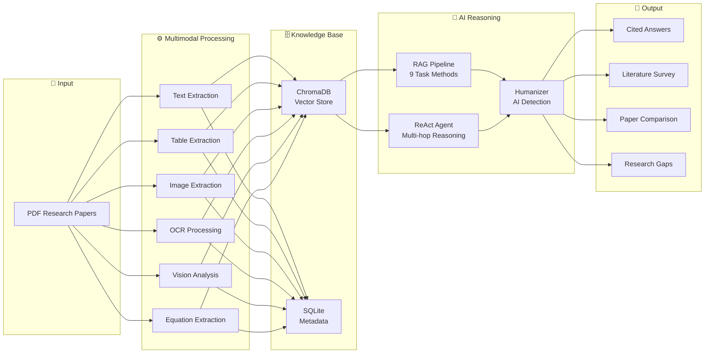

---

## Fig 2.1 — RAG Pipeline Overview
**Save as:** `fig_2_1_rag_pipeline.png`

---

## Fig 2.2 — Multimodal Document Processing Taxonomy
**Save as:** `fig_2_2_taxonomy.png`

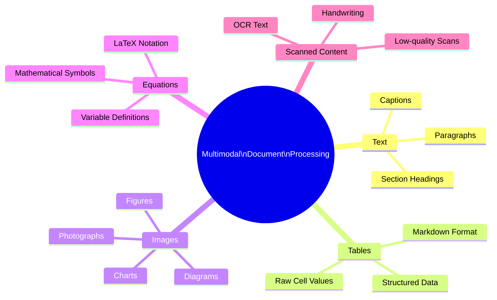

---

## Fig 2.3 — ReAct Agent Reasoning Loop
**Save as:** `fig_2_3_react_loop.png`

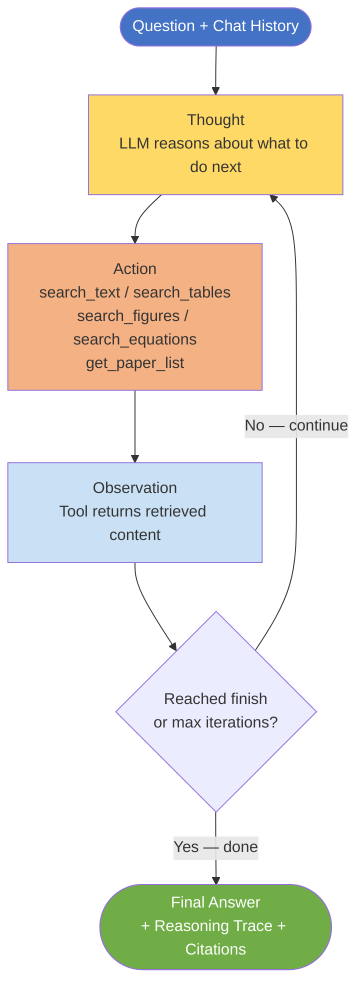

---

## Fig 4.1 — High-Level System Architecture
**Save as:** `fig_4_1_architecture.png`

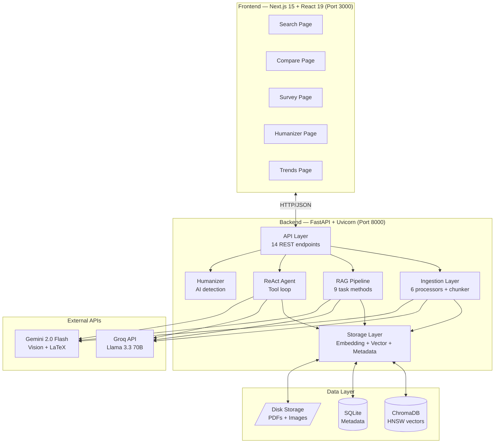

---

## Fig 4.2 — Six-Stage PDF Ingestion Pipeline
**Save as:** `fig_4_2_ingestion.png`

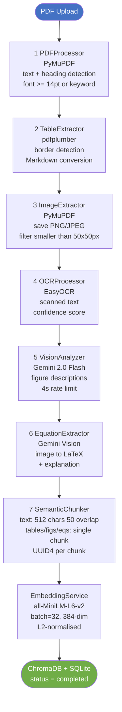

---

## Fig 4.4 — Nine-Method RAG Pipeline
**Save as:** `fig_4_4_rag_methods.png`

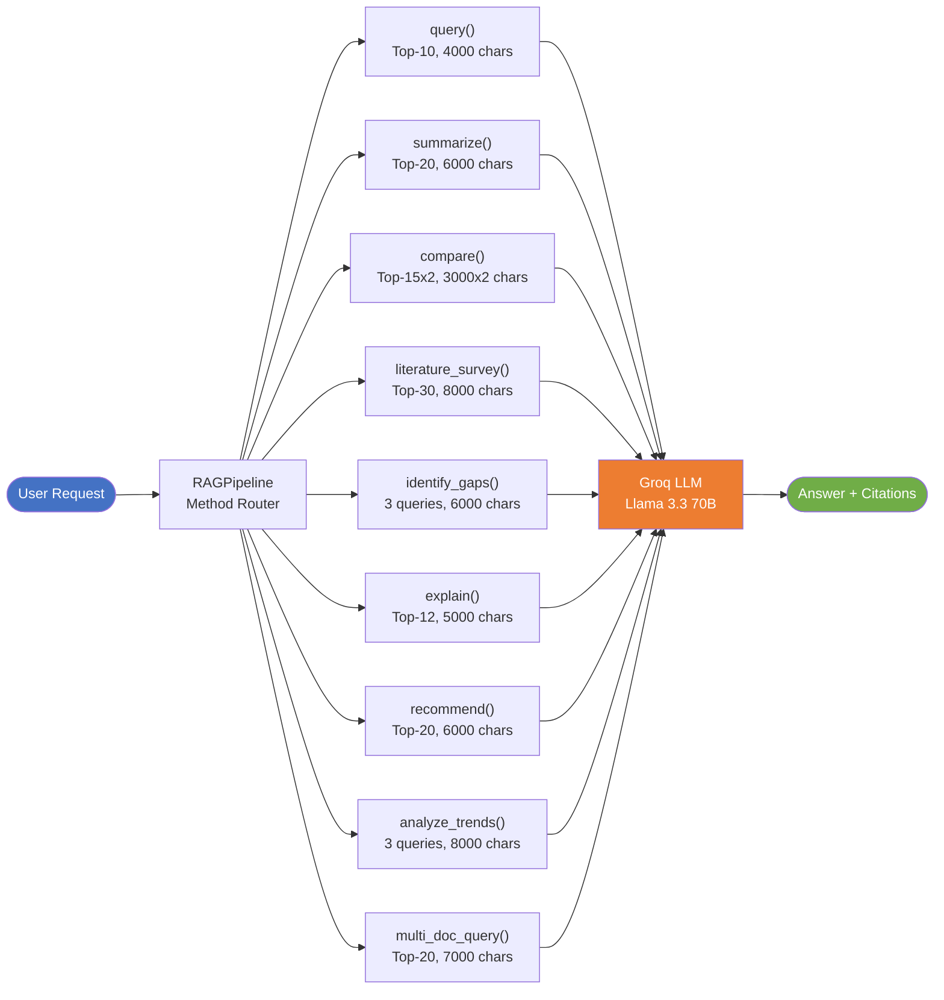

---

## Fig 4.5 — ReAct Agent Iteration Flow
**Save as:** `fig_4_5_agent_flow.png`

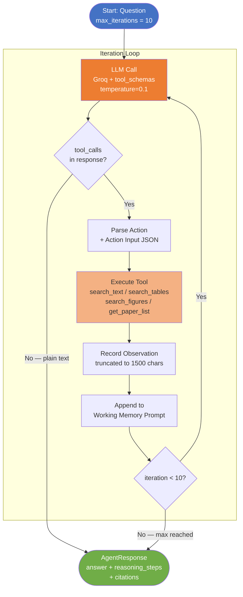

---

## Fig 4.6 — REST API Endpoint Structure
**Save as:** `fig_4_6_api.png`

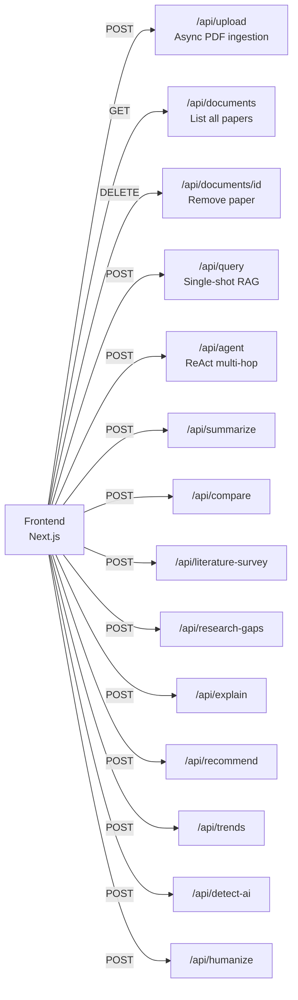

---

## Fig 4.7 — Frontend Component Hierarchy
**Save as:** `fig_4_7_frontend.png`

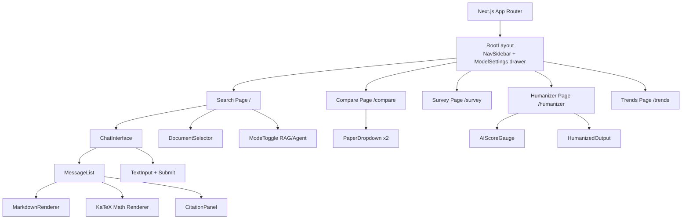

---

## Fig 5.1 — PDF Heading Detection Logic
**Save as:** `fig_5_1_heading_detection.png`

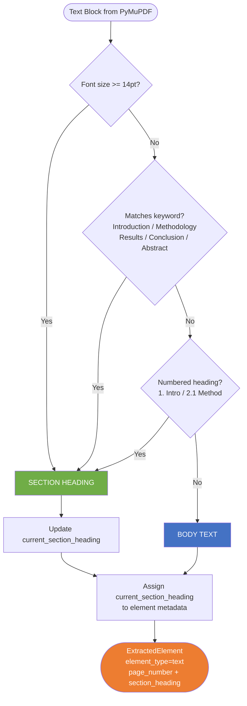

---

## Fig 5.2 — Type-Aware Chunking Strategy
**Save as:** `fig_5_2_chunking.png`

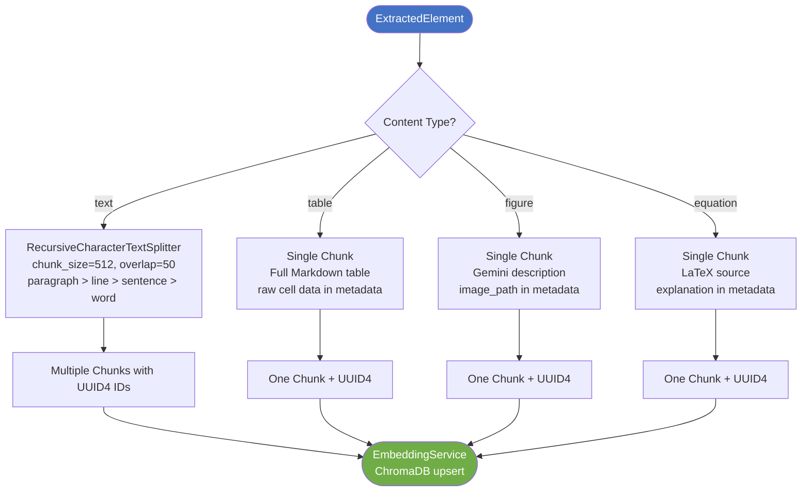

---

## Fig 5.4 — Retrieval Flow
**Save as:** `fig_5_4_retrieval.png`

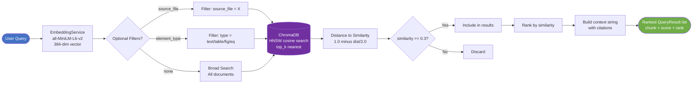

---

## Fig 5.5 — Agent Multi-Hop Reasoning Trace
**Save as:** `fig_5_5_agent_trace.png`

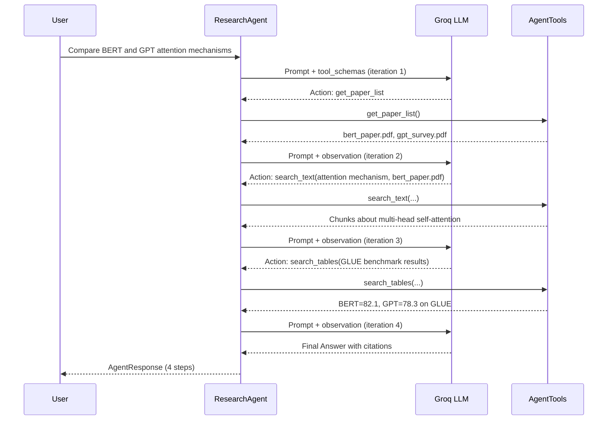

---

## Fig 5.6 — Humanizer Engine Loop
**Save as:** `fig_5_6_humanizer.png`

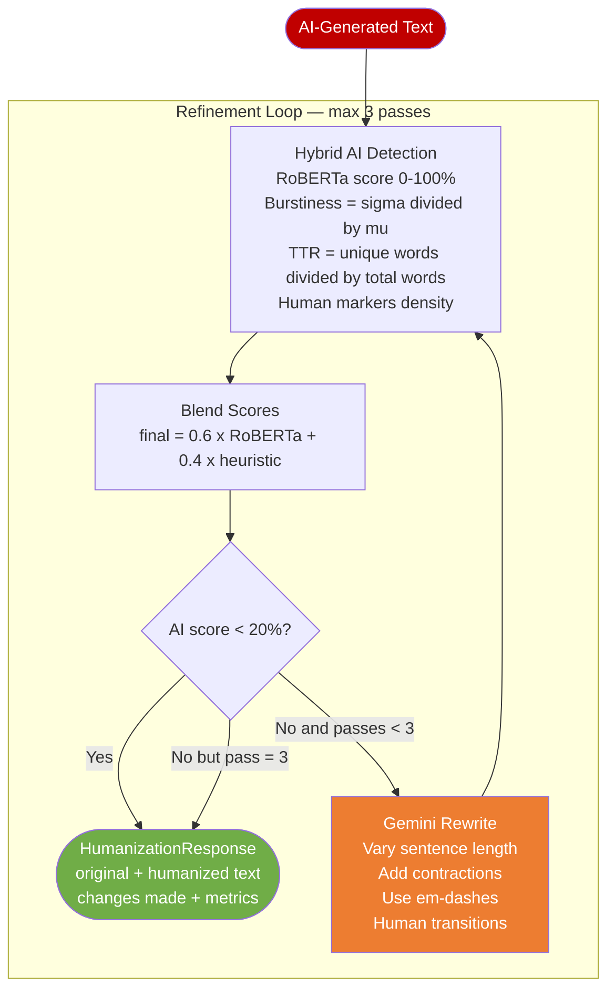

---

## Summary — All 15 filenames to save

| Figure | Save as |
|--------|---------|
| Fig 1.1 | `fig_1_1_overview.png` |
| Fig 2.1 | `fig_2_1_rag_pipeline.png` |
| Fig 2.2 | `fig_2_2_taxonomy.png` |
| Fig 2.3 | `fig_2_3_react_loop.png` |
| Fig 4.1 | `fig_4_1_architecture.png` |
| Fig 4.2 | `fig_4_2_ingestion.png` |
| Fig 4.4 | `fig_4_4_rag_methods.png` |
| Fig 4.5 | `fig_4_5_agent_flow.png` |
| Fig 4.6 | `fig_4_6_api.png` |
| Fig 4.7 | `fig_4_7_frontend.png` |
| Fig 5.1 | `fig_5_1_heading_detection.png` |
| Fig 5.2 | `fig_5_2_chunking.png` |
| Fig 5.4 | `fig_5_4_retrieval.png` |
| Fig 5.5 | `fig_5_5_agent_trace.png` |
| Fig 5.6 | `fig_5_6_humanizer.png` |
